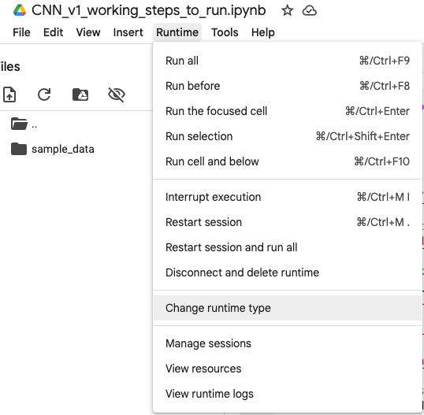
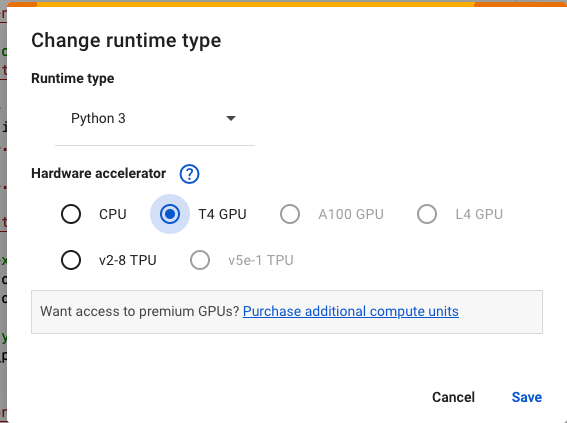
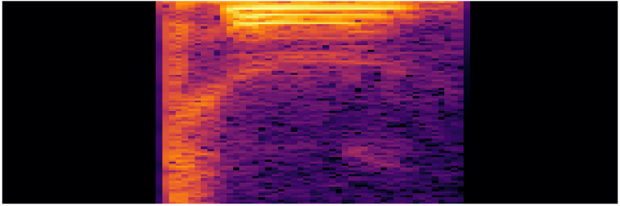

If you would like to see all of the steps below in a Colab notebook with everything ready to run, here is the link:  
📌 [Google Colab Notebook](https://colab.research.google.com/drive/18enfko92t783UyUtiDNBNvh0L2wlBvDs?usp=sharing)

> **Note:** You have to run **Steps 1-4** on your own to connect to your own Google Drive account that has the `images.zip` file with all of the `.npy` spectrograms to use.

Step 1:
Run dataset generation steps to get images folder (should have a bunch of .npy files). Once you complete dataset generation steps and cd into SpectroNet/src/datasets/images, running ls should show all the .npy files:

Step 2:
Zip the images folder (SpectroNet/src/datasets/images) to get images.zip, and put it into your google drive. Don’t put it into another folder inside your drive because otherwise you have to change the file paths in the files.

Specifically, you must change following variables that define the file paths:
In get_npy_files_from_google_drive.py:
Define the path to the zip file
zip_path = "/content/drive/My Drive/images_4.zip"

In extracts_label_loads_spectograms_load_dataset.py:
Define the path to the zip file
zip_path = "/content/drive/My Drive/images_4.zip"

Step 3:
Open a new notebook in Google colab. Change the runtime type to a T4 GPU:

Click save and now you are running a T4 GPU in colab. 
To check the number of GPUs and set the policy to mixed precision (float16 to speed up training, reduce memory usage, and still keep critical computations in float32 for numerical stability), copy and paste the code in check_gpu_mixed_precision.py. Correct output should be:

Number of GPUs available: 1
PhysicalDevice(name='/physical_device:GPU:0', device_type='GPU')
Mixed precision enabled: <DTypePolicy "mixed_float16">

If the above output is the same as what you have in colab, you have correctly set up the GPU and can move onto step 4.

Step 4:
Run the get_npy_files_from_google_drive.py code in a cell in colab to mount your google drive in colab (to access the images.zip currently in your Google Drive). There will be several pop ups asking for Google Drive access:

Click Connect to Drive

Click the google account that has the google drive containing your images.zip file.

Click continue

Click continue

If you run through the pop-ups as described in the above 4 steps, your colab should be granted access to your Google Drive and you will be able to access your images.zip file.

The code also checks if the file containing images.zip exists, and if not creates a folder in colab to put images.zip in. It then unzips the file and lists the first 20 files in the new folder in colab, which confirms that the .npy files are now able to be accessed inside colab.

Output after running get_npy_files_from_google_drive.py code in colab cell:

Mounted at /content/drive
images_4.zip found in Google Drive!
Extraction complete! Files extracted to: /content/spectrogram_data
Files inside 'images': ['5_48_11.npy', '8_06_12.npy', '2_10_27.npy', '0_04_41.npy', '4_01_36.npy', '8_26_47.npy', '2_11_36.npy', '8_59_30.npy', '0_36_33.npy', '3_16_3.npy', '0_05_19.npy', '5_47_1.npy', '2_29_8.npy', '0_27_23.npy', '9_53_9.npy', '8_34_36.npy', '0_53_44.npy', '0_57_39.npy', '3_56_41.npy', '0_06_47.npy']

If rerunning this step, will get the following as the first output line since you have already mounted the drive:
Drive already mounted at /content/drive; to attempt to forcibly remount, call drive.mount("/content/drive", force_remount=True).

Both are fine to continue to the next step

If the above output happens after running though the pop-ups and you see .npy files inside ‘images’ (as seen above in the correct output), file extraction from google drive was successful and you can move onto step 5.

Step 5:
Next, paste in the code from check_bad_spectogram.py into the next colab cell to see if there are any corrupted .npy files. If there is not, the following should be the correct output:

Checked 30000 files.
Unique spectrogram shapes found: {(96, 96)}
0 corrupt files: []
0 all-zero files: []
2_12_15.npy | Shape: (96, 96) | Min: -80.0 | Max: 0.0 | Mean: -65.06060028076172
8_12_25.npy | Shape: (96, 96) | Min: -80.0 | Max: 0.0 | Mean: -67.90231323242188
2_12_11.npy | Shape: (96, 96) | Min: -80.0 | Max: 0.0 | Mean: -65.53494262695312
1_10_22.npy | Shape: (96, 96) | Min: -80.0 | Max: 0.0 | Mean: -63.55265426635742
3_49_24.npy | Shape: (96, 96) | Min: -80.0 | Max: 0.0 | Mean: -65.1098861694336
Contains NaN? False
Contains Inf? False

If there is any other output than the one shown above (some random spectogram file numbers will be shown, but min, max, and mean should all be the same for every spectogram), redo data generation to get uncorrupted .npy files. Otherwise, Neural Net training validation accuracy and loss will suffer. Once the correct outputs for this step happens, move onto step 6.

Step 6: 
Paste in code from check_spectogram_after_load.py into a colab cell. First uncomment out the # %matplotlib inline from the imports and run it - if you don’t uncomment, the spectogram will not show inside a colab cell. This code picks a random spectogram file to show you. If this succeeds, you will be able to see a spectogram like so:

If the spectogram shows up, all file loading has been confirmed to work and you can move onto Step 7.

Step 7:
Paste the code in extracts_label_loads_spectograms_load_dataset.py to correctly extract and set up the labels and load all spectograms into the dataset to train.

Correct output:
Normalized spectrograms: Min 0.0, Max 1.0

If the above output is correct, you can check labels by pasting code in check_label_first_num.py into the next colab cell to see if the extract_label function in extracts_label_loads_spectograms_load_dataset actually worked. Correct output should be something like:
File: 9_19_47.npy → Extracted Label: 9
File: 5_09_28.npy → Extracted Label: 5
File: 0_48_15.npy → Extracted Label: 0
File: 7_38_43.npy → Extracted Label: 7
File: 8_25_46.npy → Extracted Label: 8
File: 3_50_17.npy → Extracted Label: 3
File: 4_13_46.npy → Extracted Label: 4
File: 0_27_17.npy → Extracted Label: 0
File: 4_43_9.npy → Extracted Label: 4
File: 4_37_47.npy → Extracted Label: 4
File: 5_20_31.npy → Extracted Label: 5
File: 9_56_10.npy → Extracted Label: 9
File: 2_51_29.npy → Extracted Label: 2
File: 7_28_0.npy → Extracted Label: 7
File: 8_37_26.npy → Extracted Label: 8
File: 8_59_19.npy → Extracted Label: 8
File: 9_57_37.npy → Extracted Label: 9
File: 0_46_38.npy → Extracted Label: 0
File: 2_37_28.npy → Extracted Label: 2
File: 5_27_33.npy → Extracted Label: 5
Class Distribution: Counter({9: 3000, 4: 3000, 3: 3000, 8: 3000, 0: 3000, 1: 3000, 2: 3000, 5: 3000, 7: 3000, 6: 3000})

Basically, the first number of every file should be the label, which should result in exactly 3000 files per spoken number (from 0-9).

Any other label extraction results in an uneven number of files generated per class, leading to much worse accuracy and loss during training.

If the above outputs are the same/similar to your outputs, you can move onto step 8.

Step 8:
Copy and paste the code from data_prerocessing.py into a colab cell and run it. This should split the training and validation data sets into a 80-20 split (80 for training, 20 for validation). Applies data augmentation to the training spectrogram dataset. Normalization to [0, 1] was done in the last line of extracts_label_loads_spectograms_load_dataset.py : 
# Normalize spectrograms from [-80, 0] to [0,1]
X = (X + 80) / 80

Correct outputs should be as follows:
Total Dataset Size: 30000
Train Dataset Size: 24000
Expected Validation Dataset Size: 6000
Validation Batch Shape: (32, 96, 96, 1), Labels: (32,)
Train size: 24000, Batches per epoch: 750

If the above outputs are correct, then can move onto Step 9.

Step 9:
Copy and paste code from cnn_structure_setup.py to setup the structure of the CNN for training. The current structure is the same as the kaggle tutorial, but will modify for better training as time progresses. This part will be updated to reflect those changes.

Current structure:
Three Convolutional Layers (Conv2D) → Extracts spatial features from spectrograms
Max Pooling (MaxPooling2D) → Reduces dimensionality, preventing overfitting.
Batch Normalization (BatchNormalization) → Stabilizes training and speeds up convergence.
L2 Regularization (kernel_regularizer=regularizers.l2(0.01)) → Helps prevent overfitting.
Dropout (Dropout(0.5)) → Adds randomness to prevent memorization.
Final Dense Layer with Softmax (Dense(N_CLASSES, activation='softmax')) → Classifies into N_CLASSES.

Used loss='sparse_categorical_crossentropy',  # Matches Example to match the kaggle tutorial  (y is still a vector of integer class labels (0–9), not one-hot vectors). 

Once the above is done, can now train the model in step 10.

Step 10: 
Copy and paste code from train_model.py to train the model. Several modifications were made from the kaggle tutorial to have better validation accuracy and loss metrics(lr_scheduler and increase number of epochs to 20). 

After several attempts at training, validation accuracy ranged from 88% - 91% whereas validation loss ranges from 2.7/3.2 at the start to 0.21/0.33 at the end. 

During training, several spikes in validation loss have been observed, mainly between epochs 6-12 of the total 20 epochs. Currently working to overcome this issue.

Example training run output:
Epoch 1/20
187/187 ━━━━━━━━━━━━━━━━━━━━ 23s 43ms/step - accuracy: 0.2440 - loss: 2.7908 - val_accuracy: 0.1994 - val_loss: 2.7909

Epoch 2/20
187/187 ━━━━━━━━━━━━━━━━━━━━ 9s 50ms/step - accuracy: 0.5552 - loss: 1.3790 - val_accuracy: 0.3927 - val_loss: 2.0264

Epoch 3/20
187/187 ━━━━━━━━━━━━━━━━━━━━ 6s 34ms/step - accuracy: 0.6624 - loss: 1.0217 - val_accuracy: 0.6800 - val_loss: 0.9285

...
Epoch 17/20
187/187 ━━━━━━━━━━━━━━━━━━━━ 7s 38ms/step - accuracy: 0.9178 - loss: 0.2722 - val_accuracy: 0.8812 - val_loss: 0.3710

Epoch 18/20
187/187 ━━━━━━━━━━━━━━━━━━━━ 11s 57ms/step - accuracy: 0.9189 - loss: 0.2607 - val_accuracy: 0.8966 - val_loss: 0.3312

Epoch 19/20
187/187 ━━━━━━━━━━━━━━━━━━━━ 2s 12ms/step - accuracy: 0.9125 - loss: 0.2726 - val_accuracy: 0.8907 - val_loss: 0.3555

Epoch 20/20
187/187 ━━━━━━━━━━━━━━━━━━━━ 6s 31ms/step - accuracy: 0.9221 - loss: 0.2412 - val_accuracy: 0.8862 - val_loss: 0.3432
dict_keys(['accuracy', 'loss', 'val_accuracy', 'val_loss'])

Once the training is done, we can move to step 11 to better understand training vs validation loss and accuracy.

Step 11:
Run plot_training.py to plot 2 graphs ( training vs validation accuracy and training vs validation loss) to note any appreciable change in training vs validation loss and accuracy.

Example plot from the same training run shown in step 10:
