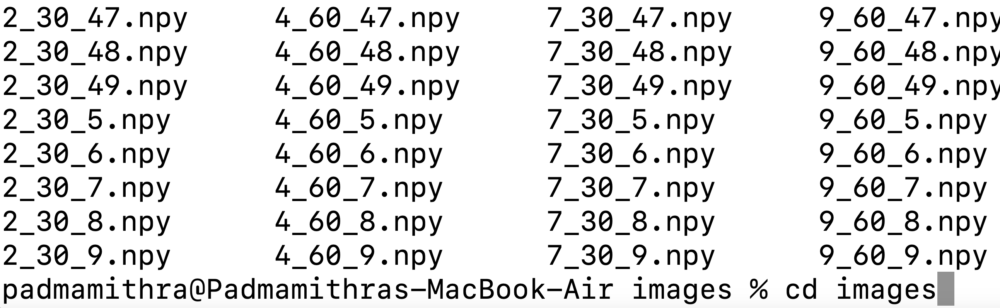

If you would like to see all of the steps below in a Colab notebook with everything ready to run, here is the link:  
📌 [Google Colab Notebook](https://colab.research.google.com/drive/18enfko92t783UyUtiDNBNvh0L2wlBvDs?usp=sharing)

> **Note:** You have to run **Steps 1-4** on your own to connect to your own Google Drive account that has the `images.zip` file with all of the `.npy` spectrograms to use.

